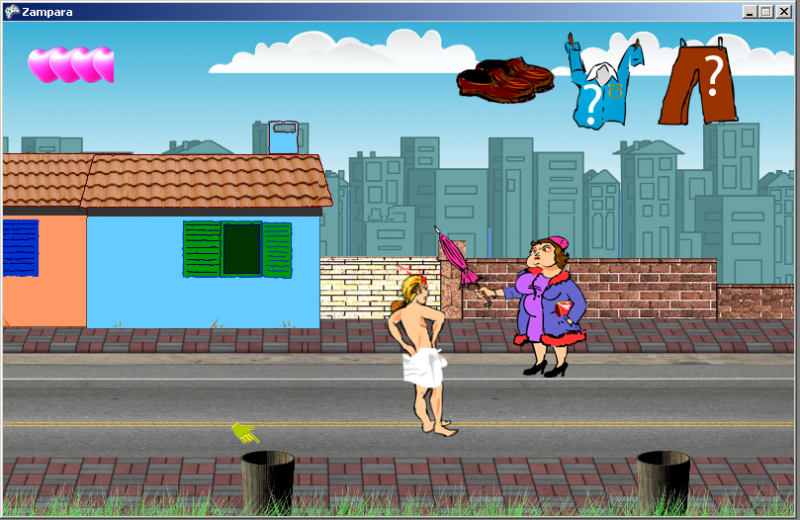

### Zampara ###

Zampara is a game we developed in Global Game Jam. 

Behlul gets caught in bed with the lady he is having an affair with as the husband walks in. We play him in this platformer-style game, while he tries to get himself home. He needs to find some clothes and run away from people on the street by hiding in trash cans. 

See the team on our GGJ page: http://archive.globalgamejam.org/2010/zampara-group-tayfa

### Technical ###

Zampara was implemented in C# as a 2D platformer/adventure game. The main characters name 'Behlul' is an attribute to the character in beloved novel and tv series titled 'Ask-i Memnu' (Forbidden Love) (see https://en.wikipedia.org/wiki/A%C5%9Fk-%C4%B1_Memnu)
